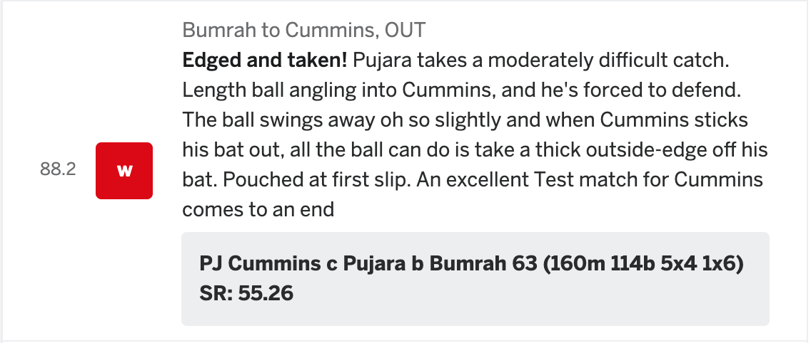

## Project Title

This project helps to scrape the ball-by-ball cricket commentary from the popular website cricinfo. 

## Getting set-up 

### Install Python 

To check if your computer already has Python installed, try the below on Terminal (Mac) or Command Prompt (Windows):

```
python --version
```

If you see a Python version returned (like 2.7.13), you already have Python !

Macbooks have Python 2.7 installed by default. That is good enough for us!

Windows: Follow this you tube video and get yourself set-up. Go ahead click on the image below:

[](https://www.youtube.com/watch?v=lnse_uD-MaA)

This will install Python 3.x on your Windows machine. 


### Install the packages

Your default Python installation may not have some of the packages needed to run this code.  The list of the required packages is in the requirements.txt file in the code repo. 

To install these packages run the below command on the Terminal (Mac) or Command Prompt (Windows): 

```
pip install -r requirements.txt
```

Note: 
If you have 

## Running the Code 

To run the code, just use the below on your Terminal (Mac) or Command prompt (Win):

```
python scrape_cric.py --match=1122276 --series=18065
```

Look for the output/1122276-18065.csv

### Interpreting the Outcome 

Each row of data is 1 ball of the test match.  

On Cricinfo, the commentary of a particular ball looks like this: 



The columns in the csv file will be structured data points of a particular ball, i.e. the batsman, the bowler etc.
